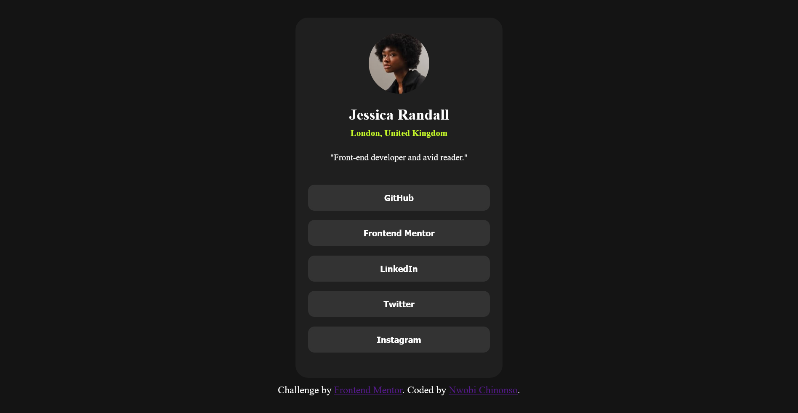

# Social Links Profile

A profile card with social link buttons, built as a [Frontend Mentor](https://www.frontendmentor.io) challenge. This was the first website I ever built, during my internship in [2nd_year].

**[Live demo]()**

## About

The challenge is to recreate a profile card from a design file: a centred card with an avatar, name, location, short bio and a stack of social buttons. I used it to practise the basics of HTML structure and CSS styling.

## Built with

- HTML5
- CSS3
- [Flexbox]

## What I practised

- Writing semantic HTML and structuring a page
- Styling text, buttons and cards with CSS
- [Centring a card on the page]
- [Hover and focus states for the buttons, if you added them]
- Matching a design file as closely as I could

## Author

Nwobi Chinonso, [GitHub](https://github.com/non1000)

Challenge by [Frontend Mentor](https://www.frontendmentor.io?ref=challenge).